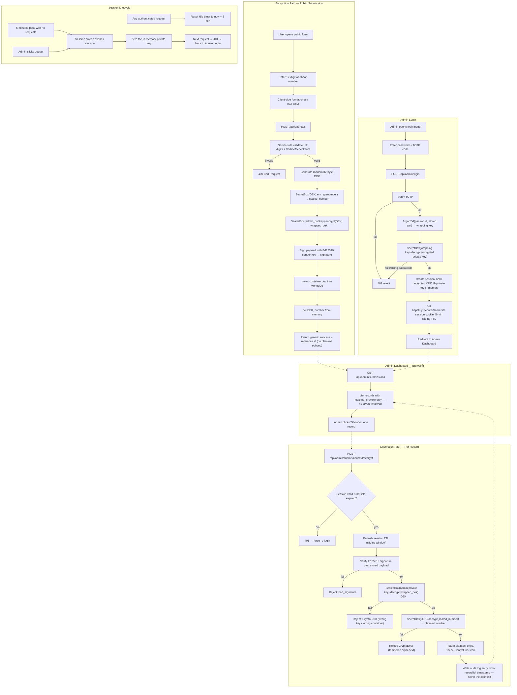

# Secure Aadhaar Transmission System

A server-side system for accepting an Aadhaar number through a public form, encrypting it before it ever touches the database, and letting authenticated admins decrypt individual records on demand using envelope encryption and modern, audited cryptographic primitives (Ed25519 / X25519 / Argon2id via libsodium).

**Multi-admin**: one **master** admin (created via the one-time web self-registration flow, gated by `ADMIN_SETUP_TOKEN`) can create additional **sub-admins** from their dashboard — no setup token needed for that, just being logged in as master. Every admin (master or sub) has their own username, password, and TOTP device. A new sub-admin is retroactively granted access to every Aadhaar number submitted *before* they existed, not just future ones — see [Multi-Admin Design](#multi-admin-design).

> **Status:** In progress — Phases 1–3 implemented and tested (121 tests passing), including local + AWS KMS admin identity providers, full multi-admin support, and frontend pages for submission, login, self-registration, the admin dashboard, and admin management. The KMS provider is only mock-tested so far — see [Open Decisions](#open-decisions) before trusting it in production. This README is the living project plan — update it as phases complete.

---

## Table of Contents

1. [Goals & Non-Goals](#goals--non-goals)
2. [Architecture Overview](#architecture-overview)
3. [Full Project Flow Chart](#full-project-flow-chart)
4. [Cryptographic Design](#cryptographic-design)
5. [Data Model](#data-model)
6. [Multi-Admin Design](#multi-admin-design)
7. [Tech Stack](#tech-stack)
8. [Repository Structure](#repository-structure)
9. [Getting Started (Backend)](#getting-started-backend)
10. [API Surface](#api-surface)
11. [Security & Hardening Checklist](#security--hardening-checklist)
12. [Legal & Compliance](#legal--compliance)
13. [Roadmap / Phased Plan](#roadmap--phased-plan)
14. [Testing Plan](#testing-plan)
14. [Open Decisions](#open-decisions)

---

## Goals & Non-Goals

**Goals**
- Accept a 12-digit Aadhaar number from a public-facing form and encrypt it in memory before any write to the database.
- Ensure the plaintext number can only ever be recovered by one authenticated admin, using a password they alone know.
- Guarantee that a wrong key, wrong password, or tampered record fails cleanly — never returns corrupted or forged data.
- Keep the admin's exposure window minimal: masked list view by default, per-record decrypt on demand, automatic session expiry.
- Use only standard, audited cryptographic constructions — no hand-rolled padding/salt logic.

**Non-Goals (for v1)**
- Multi-admin / role-based access control (the envelope-encryption design leaves room for this later, but v1 ships single-admin).
- UIDAI e-KYC integration or Aadhaar number *verification* (checksum/Verhoeff validation is in scope; live UIDAI API calls are not).
- FIPS-140 *module* validation (see [Open Decisions](#open-decisions)).

---

## Architecture Overview

Two independent identities, both long-lived, both generated once at bootstrap:

- **Sender identity (Ed25519 keypair)** — lives on the server only. Signs every stored record so the admin can verify it wasn't forged or corrupted before decrypting it. Private key never leaves the server; not password-protected (it's a service identity, not a human secret).
- **Admin identity (asymmetric keypair, pluggable custody)** — the public half wraps every message's one-time data key; the private half is what decryption actually needs. Two interchangeable providers, selected per environment:
  - **Local provider (dev/test — built in Phase 1/2)**: an **X25519** keypair. The private key is encrypted at rest with a key derived from the admin's password (Argon2id), and is decrypted into the backend process's memory for the duration of a session.
  - **AWS KMS provider (production — planned for Phase 3)**: an **ECC P-256** asymmetric key generated *inside* AWS KMS with `KeyUsage=KEY_AGREEMENT`, non-exportable. The raw private key never leaves KMS's boundary, not even during an active admin session — decryption calls a KMS key-agreement operation and gets back only a derived shared secret. This closes the "private key sitting in app RAM" exposure that the local provider still has, and rides on KMS's FIPS 140-validated HSMs. See [Open Decisions](#open-decisions) for the full tradeoff.

  Either way, the admin's password + TOTP code remain what *authenticates the admin to the backend* — with the KMS provider, the password no longer directly decrypts anything itself; it gates whether the backend (using its own IAM identity) is allowed to ask KMS to perform the operation. AWS KMS does not support Curve25519, which is why the KMS provider uses P-256 instead of X25519 — the sender's Ed25519 signature and the per-message DEK/number encryption are unaffected either way.

Every submitted Aadhaar number gets its own random one-time **DEK** (data encryption key) — this is envelope encryption, the same pattern used by AWS KMS / GCP KMS: a cheap symmetric key does the bulk encryption, and a long-lived asymmetric identity key wraps that one-time key. It means one leaked DEK exposes exactly one record, and it means multi-admin support later is just "wrap the same DEK to more public keys" rather than a redesign. It also means the **public submission path never depends on KMS availability** — wrapping only ever needs the admin's *public* key, which is cached locally regardless of which provider holds the private half.

```
                          ┌────────────────────────────────────┐
                          │   Admin identity keypair              │  long-lived
                          │   pub  → stored plaintext, cached      │
                          │   priv → local: SecretBox(Argon2id(pw))│  dev/test
                          │        → prod:  held inside AWS KMS,   │  never exported
                          │                 never touches app RAM  │
                          └───────────────┬────────────────────┘
                                          │ wraps
┌───────────────┐   generate    ┌───────▼───────┐   encrypts     ┌────────────────┐
│ Public submit  │──────────────▶│ random 32B DEK │───────────────▶│ sealed_number    │
│ (Aadhaar #)    │               │ (one per msg)  │  SecretBox      │ (ciphertext)     │
└───────────────┘               └────────────────┘                └────────────────┘
        │                                                                    │
        └───────────── signed together as one payload (Ed25519, sender key) ┘
                                          │
                                          ▼
                                MongoDB `containers` collection
```

---

## Full Project Flow Chart



---

## Cryptographic Design

All primitives come from **libsodium** via the `PyNaCl` Python binding — chosen deliberately over hand-assembled RSA-PSS/RSA-OAEP to remove custom salt/padding logic entirely and rely on constructions that are widely audited and hard to misuse. The one exception is the production admin-identity key, which lives in **AWS KMS** and uses KMS's own ECC P-256 key-agreement operation instead of libsodium (see the last row).

| Purpose | Primitive | Notes |
|---|---|---|
| Signing every record | **Ed25519** (EdDSA, RFC 8032) | Deterministic — no externally supplied salt/nonce of any kind, so it's structurally immune to the weak-RNG nonce-reuse bugs that affect RSA-PSS/ECDSA when done by hand. FIPS 186-5 (2023) approved. |
| Wrapping the one-time DEK (local provider) | **X25519** via `nacl.public.SealedBox` | Standard ECIES-style "encrypt to a public key" construction. Replaces RSA-OAEP — no padding-oracle risk class, 32-byte keys instead of 2048–4096-bit blobs. Dev/test only. |
| Wrapping the one-time DEK (KMS provider) | **ECC P-256 ECDH**, sender-side done locally with libsodium-equivalent math, admin-side via an **AWS KMS key-agreement operation** | Encryption still only needs the admin's cached *public* key, so the public submit path never calls AWS. Decryption sends the container's ephemeral public key to KMS and gets back a shared secret — HKDF-SHA256 turns that into the key that opens the DEK. The P-256 private key never leaves KMS. Exact KMS API operation/parameters to be confirmed against current AWS docs at Phase 3 implementation time. |
| Encrypting the Aadhaar number | **XSalsa20-Poly1305** via `nacl.secret.SecretBox` | Authenticated encryption; nonce is generated and embedded by the library, removing manual nonce-management bugs. Functionally equivalent guarantee to AES-256-GCM (see [Open Decisions](#open-decisions) for when to swap back). Identical in both providers — only the DEK-wrapping step differs. |
| Password → key-encryption-key (local provider) | **Argon2id** (RFC 9106) | Memory-hard KDF for wrapping the admin's private key at rest. Wrong password → decryption of the private key fails cleanly, which *is* the login check — no separate password hash stored. |
| Password verification (KMS provider) | **Argon2id password hash** (verifier only, not a decryption key) | With the KMS provider there's no local private-key blob to unlock, so the password's job changes: it authenticates the admin to the backend (gating whether the backend's IAM identity is allowed to call KMS on their behalf), rather than cryptographically unlocking anything itself. |

**The unlock chain — local provider (dev/test, what Phase 1/2 implement today):**

1. Admin types password + TOTP code — the only two things they ever have to know/hold.
2. Password derives (via Argon2id) the key that decrypts the stored X25519 private key.
3. That private key un-seals the one-time DEK for whichever record is requested.
4. The DEK decrypts that record's Aadhaar number.
5. Everything from step 2 downward is reconstructed automatically and discarded after use or after 5 minutes of inactivity.

**The unlock chain — AWS KMS provider (planned production path):**

1. Admin types password + TOTP code, authenticating to the backend (no private key is unlocked by this step).
2. The backend's own IAM role — not the admin's password — is what KMS trusts; the session simply authorizes the backend to make KMS calls on the admin's behalf for its 5-minute sliding window.
3. On decrypt, the backend sends the container's ephemeral public key to KMS; KMS performs ECDH internally and returns a derived shared secret, never the private key itself.
4. HKDF-SHA256 turns that shared secret into the key that un-seals the DEK, which then decrypts the number.
5. No private key material ever exists in the backend process — CloudTrail logs the KMS call itself, giving an AWS-side audit trail independent of this app's own `audit_log`.

**Why this replaces the original HMAC-PRNG + RSA-PSS approach:** RSA-PSS already randomizes its own salt internally per RFC 8017 — augmenting it with a custom HMAC-derived salt added no provable security, only custom code, an extra shared secret to protect (`HMAC_KEY`), and audit burden. Ed25519 removes the question entirely by needing no external randomness for signing at all.

---

## Data Model

**`containers` collection** — one document per submitted Aadhaar number. The DEK is wrapped once per admin who can read it (`wrapped_deks`), not just one — see [Multi-Admin Design](#multi-admin-design):

```jsonc
{
  "_id": ObjectId,
  "created_at": ISODate,
  "alg": "sealedbox-x25519+secretbox-xsalsa20poly1305+ed25519-v3",
  "wrapped_deks": {                    // admin_id -> wrapped DEK, one entry per admin with access
    "<admin_id_1>": "…",               // SealedBox(admin_1_pub).encrypt(dek)
    "<admin_id_2>": "…"                // SealedBox(admin_2_pub).encrypt(dek) — same dek, different wrap
  },
  "sealed_number_b64": "…",            // SecretBox(dek).encrypt(number) — nonce+ciphertext+tag combined
  "signature_b64": "…",                // Ed25519 signature over the *whole* {wrapped_deks, sealed_number_b64}
  "masked_preview": "XXXX-XXXX-1234"
}
```

**`admins` collection** — one document per admin (master or sub), keyed by a unique `username`. Replaces the old single-file `admin_identity.json` model:

```jsonc
{
  "_id": ObjectId,
  "username": "…",
  "role": "master" | "sub",
  "status": "active" | "disabled",
  "key_provider": "local",             // or "aws-kms" — see Cryptographic Design
  "public_key_b64": "…",               // X25519 public key, safe to expose
  "totp_secret_encrypted": "…",        // TOTP seed, encrypted at rest under APP_TOTP_KEY
  "encrypted_private_key": {           // local provider only
    "kdf": "argon2id",
    "salt_b64": "…", "time_cost": 3, "memory_cost_kib": 65536, "parallelism": 4,
    "sealed_priv_b64": "…"             // SecretBox(argon2id_key).encrypt(x25519_private_key)
  },
  "created_by": "<admin_id>" | null,   // null for the master
  "created_at": ISODate
}
```

The sender's Ed25519 signing identity is **not** stored per-admin — it's one server-wide identity (`backend/secrets/sender_signing_key.b64`), unrelated to how many admin accounts exist. The verify key is derived from it on demand (`identity.verify_key_from_signing_key`), never stored separately.

**`audit_log` collection** — append-only, one entry per decrypt action, now attributed to the specific admin who did it:

```jsonc
{
  "_id": ObjectId,
  "ts": ISODate,
  "container_id": ObjectId,
  "action": "decrypt",
  "result": "success" | "bad_signature" | "crypto_error",
  "admin_username": "…"
}
```

---

## Multi-Admin Design

- **One master, any number of sub-admins.** The master is created once via the web self-registration flow (`/admin/register`, gated by `ADMIN_SETUP_TOKEN` — see [Getting Started](#getting-started-backend)). Every admin after that is created by a logged-in master through `/admin/manage` — no setup token involved, being authenticated as master *is* the authorization.
- **Every admin has their own password + TOTP device.** Sub-admins are not a shared account — they log in with their own username, same as the master.
- **Sub-admins get full decrypt access**, including to Aadhaar numbers submitted *before* they existed. When a sub-admin is created, `admin_management_service._grant_retroactive_access` walks every existing `containers` document, unwraps its DEK using the *master's* already-unlocked session key, re-wraps that same DEK for the new admin, and re-signs the container (the signature covers the whole `wrapped_deks` map, so adding an entry changes what must be signed). This is idempotent — a container that already has an entry for the new admin is skipped, so a partially-failed run is always safe to re-run.
- **New submissions after that point** are wrapped for every currently active admin automatically (`submission_service.encrypt_and_store` calls `admins_service.list_active()` and wraps once per admin, through *that admin's own* identity provider — local and KMS wrap differently, so this dispatches per admin rather than assuming one scheme for everyone).
- **Master-only actions** (`GET /api/admin/admins`, `POST /api/admin/admins/start`, `POST /api/admin/admins/confirm`) are gated by `require_master_session` (`app/deps.py`), which checks `session.role == "master"` on top of the normal session check.
- **Scope for now**: multi-admin wrapping assumes every admin uses the **local** provider. A KMS-provider admin can still exist and log in fine on its own, but isn't created through the master's "create sub-admin" flow (that flow only builds local X25519 identities) — mixing local and KMS admins in the same wrapped_deks map works correctly per-entry, but isn't a scenario this project exercises deliberately.
- **Migrating an existing single-admin deployment**: `backend/scripts/migrate_to_multi_admin.py` reads the old `admin_identity.json`, inserts it into `admins` as the master (you're asked for a username), and converts every old-format `containers` document (`wrapped_dek_b64`) into the new `wrapped_deks` map + re-signs it. The old JSON file is left on disk untouched as a backup. Refuses to run if the `admins` collection already has anything in it.

---

## Tech Stack

| Layer | Choice |
|---|---|
| Backend | Python, FastAPI, Motor (async MongoDB driver) |
| Crypto | PyNaCl (libsodium bindings), `argon2-cffi` |
| Database | MongoDB |
| Frontend | React + Vite (TypeScript) |
| Auth | Password (Argon2id) + TOTP (MFA), session cookie (httpOnly/Secure/SameSite) |
| Rate limiting | `slowapi` |
| Containerization | Docker + Docker Compose (backend + MongoDB) |

---

## Repository Structure

```
secure-aadhaar-system/
├── README.md                          # this file
├── backend/
│   ├── app/
│   │   ├── main.py                    # FastAPI app: CORS, rate-limit handler, routers, /health
│   │   ├── config.py                  # env/settings: APP_TOTP_KEY, Mongo URI/db, frontend origin
│   │   ├── db.py                      # Motor client + collection accessors
│   │   ├── rate_limit.py              # shared slowapi Limiter instance
│   │   ├── deps.py                    # require_admin_session FastAPI dependency
│   │   ├── validation.py              # 12-digit + Verhoeff checksum Aadhaar format validation
│   │   ├── crypto/
│   │   │   ├── exceptions.py          # BadSignatureError, BadTagError
│   │   │   ├── identity.py            # Ed25519 + X25519 keypair generation
│   │   │   ├── envelope.py            # seal/unseal DEK, encrypt/decrypt number
│   │   │   ├── password_utils.py      # Argon2id + SecretBox for private-key-at-rest (local provider)
│   │   │   ├── totp_utils.py          # TOTP MFA generation/verification, encrypted at rest
│   │   │   └── kms_provider.py        # AWS KMS-backed admin identity — mock-tested, not yet run against real KMS
│   │   ├── providers/
│   │   │   └── identity_provider.py   # IdentityProvider/UnlockedIdentity interface + LocalIdentityProvider;
│   │   │                              #   routers/services only ever talk to this, never crypto internals
│   │   ├── models/
│   │   │   ├── container.py           # Container, submit/list/decrypt request+response schemas
│   │   │   └── admin_identity.py      # login/register/admin-management request+response schemas
│   │   ├── routers/
│   │   │   ├── public.py              # POST /api/aadhaar (rate-limited)
│   │   │   └── admin.py               # login/me/register/admins (manage)/submissions/decrypt/logout
│   │   ├── services/
│   │   │   ├── admin_identity_service.py    # sender signing key only (file-based, server-wide identity)
│   │   │   ├── admins_service.py            # Mongo CRUD for the `admins` collection (master + subs)
│   │   │   ├── admin_registration_service.py  # first-admin (master) self-registration, setup-token-gated
│   │   │   ├── admin_management_service.py    # master-gated sub-admin creation + retroactive re-wrap
│   │   │   ├── submission_service.py        # encryption-path orchestration, wraps for every active admin
│   │   │   ├── decrypt_service.py           # decryption-path orchestration (provider-agnostic)
│   │   │   ├── admin_session.py             # in-memory sliding-TTL session store (admin_id/username/role)
│   │   │   └── audit_service.py             # decrypt-action log, attributed to the admin (Phase 4: hash-chaining)
│   │   └── __init__.py
│   ├── scripts/
│   │   ├── bootstrap_admin.py          # one-time CLI: create the master admin (Mongo-backed) — local or AWS KMS
│   │   └── migrate_to_multi_admin.py   # one-off: old single-file admin_identity.json -> `admins` collection
│   ├── secrets/                       # gitignored — sender_signing_key.b64 lives here (admin identities are in Mongo now)
│   ├── tests/                         # 121 passing
│   ├── requirements.txt
│   ├── pytest.ini
│   ├── .env.example
│   └── .gitignore
├── frontend/
│   └── src/
│       ├── pages/
│       │   ├── SubmitAadhaar.tsx
│       │   ├── AdminLogin.tsx
│       │   ├── AdminRegister.tsx      # first-admin (master) self-registration, setup-token-gated
│       │   ├── AdminDashboard.tsx
│       │   └── AdminManagement.tsx    # master-only: list admins, create sub-admin
│       └── api/client.ts
└── docker-compose.yml                                                     [Phase 0/6]
```

---

## Getting Started (Backend)

```bash
cd backend
python -m venv venv
venv\Scripts\activate            # Windows; use `source venv/bin/activate` on macOS/Linux
pip install -r requirements.txt

# Set the server-side TOTP-encryption secret (required before bootstrapping):
cp .env.example .env
python -c "import nacl.utils, base64; print(base64.b64encode(nacl.utils.random(32)).decode())"
# paste the output as APP_TOTP_KEY= in .env

# One-time: generate the sender signing key + the first (master) admin, set their username/password, set up TOTP
python scripts/bootstrap_admin.py
# scan the printed otpauth:// URI / QR into an authenticator app when prompted
# (equivalently, the web UI's /admin/register page does the same thing for the local provider)

pytest -v                        # run the full test suite (121 tests)

# Run the API (needs a MongoDB reachable at MONGO_URI, default mongodb://localhost:27017 — Docker Compose lands in Phase 0/6):
uvicorn app.main:app --reload
# GET http://127.0.0.1:8000/health should return {"status": "ok"}
```

`bootstrap_admin.py` must be run from a real interactive terminal — on Windows, `getpass.getpass()` reads directly from the console (via `msvcrt`), not from redirected stdin, so it can't be driven through a piped/non-interactive harness. Refuses to run at all if any admin already exists in `admins` (there's deliberately no `--force` — see `scripts/migrate_to_multi_admin.py` for the one-time migration path from an old single-admin deployment instead).

Bootstrap writes:
- The new master admin into MongoDB's `admins` collection — matches the schema in [Data Model](#data-model).
- `backend/secrets/sender_signing_key.b64` — the server's Ed25519 signing key. Treat as a production secret: move it into a secrets manager and delete the on-disk copy before deploying. `submission_service` / `admin.py` will use `SENDER_SIGNING_KEY_B64` from the environment instead, if set.

**To bootstrap against AWS KMS instead** (after creating the KMS key + IAM role — see chat history / README Open Decisions for the exact `aws kms create-key` + IAM policy steps): set `ADMIN_KEY_PROVIDER=aws-kms`, `AWS_REGION`, `AWS_KMS_KEY_ID`, and either `AWS_PROFILE` (local testing) or nothing at all (production, IAM role attached to the compute resource) in `.env`, then run `bootstrap_admin.py` the same way. It will `describe_key` to verify the key is `ECC_NIST_P256`/`KEY_AGREEMENT` before creating the admin.

**Adding sub-admins**: not via the CLI — log in as master in the web UI and use `/admin/manage` → "Create Sub-Admin". See [Multi-Admin Design](#multi-admin-design).

---

## API Surface

| Method | Path | Auth | Purpose |
|---|---|---|---|
| `POST` | `/api/aadhaar` | none (rate-limited) | Encrypt + store a submitted Aadhaar number |
| `GET` | `/api/admin/register/status` | none | Whether any admin exists yet |
| `POST` | `/api/admin/register/start` | `ADMIN_SETUP_TOKEN` | Begin first-admin (master) self-registration |
| `POST` | `/api/admin/register/confirm` | none (registration token) | Confirm TOTP, create the master admin |
| `POST` | `/api/admin/login` | username + password + TOTP | Verify credentials, unlock private key into session |
| `GET` | `/api/admin/me` | session | Current admin's id/username/role |
| `POST` | `/api/admin/logout` | session | Destroy session, zero in-memory private key |
| `GET` | `/api/admin/admins` | session (master only) | List all admins |
| `POST` | `/api/admin/admins/start` | session (master only) | Begin sub-admin creation |
| `POST` | `/api/admin/admins/confirm` | session (master only) | Confirm TOTP, create the sub-admin, grant retroactive access |
| `GET` | `/api/admin/submissions` | session | List records, masked previews only |
| `POST` | `/api/admin/submissions/{id}/decrypt` | session | Decrypt one record on demand |

---

## Security & Hardening Checklist

- [ ] TLS everywhere, HSTS
- [x] Secrets via environment, never committed — `APP_TOTP_KEY`, optional `SENDER_SIGNING_KEY_B64`, `backend/secrets/` gitignored (production secrets-manager migration still open)
- [x] Rate limiting on public submit endpoint (`slowapi`, 5/min per IP) — CAPTCHA still open
- [x] CORS locked to frontend origin (`FRONTEND_ORIGIN` env, defaults to the local Vite dev server)
- [ ] CSRF token alongside admin session cookie
- [ ] No plaintext Aadhaar numbers, keys, or passwords in logs or stack traces (not yet explicitly audited)
- [ ] MongoDB with auth + TLS, network-restricted
- [ ] Admin panel network-segmented (VPN/IP allowlist), not reachable the same way as the public form
- [x] MFA (TOTP) required for admin login — verified before the password-derived unlock even begins
- [ ] Hash-chained, tamper-evident audit log of every decrypt action (Phase 3 has plain entries; Phase 4 adds hash-chaining)
- [x] 5-minute sliding idle timeout on admin sessions
- [ ] Key-rotation runbook written and rehearsed before go-live
- [ ] Encrypted backups governed with the same access controls as production
- [ ] Defined data retention / erasure policy

---

## Legal & Compliance

Aadhaar numbers are protected under India's **Aadhaar Act, 2016** and UIDAI regulations — collecting/storing them as a private entity generally requires UIDAI authorization (AUA/KUA/sub-AUA licensing), masking on display outside authorized use, and breach-notification obligations. The **DPDP Act, 2023** additionally imposes consent and purpose-limitation duties. This system's crypto design is independent of that legal status — **do not point this system at real citizens' Aadhaar numbers until the legal/regulatory prerequisites are confirmed.** Use synthetic 12-digit test numbers throughout development.

---

## Roadmap / Phased Plan

- [ ] **Phase 0 — Scaffold**: backend/frontend skeletons, Docker Compose with MongoDB, env config
- [x] **Phase 1 — Crypto core**: `identity.py`, `envelope.py`, `password_utils.py` + unit tests for every failure mode (wrong password, tampered ciphertext, tampered signature, wrong admin's container) — `backend/app/crypto/`, 21 tests passing
- [x] **Phase 2 — Admin bootstrap**: CLI script generating sender + admin keypairs, initial password + TOTP setup — `backend/scripts/bootstrap_admin.py`, 11 new tests passing (43 total)
- [x] **Phase 3 — Backend API**: public submit endpoint, admin login (username + password + TOTP)/session/list/decrypt/logout, rate limiting, full **multi-admin support** (master self-registration, master-gated sub-admin creation, retroactive DEK re-wrap) — `backend/app/{providers,services,routers,models}/`, plus both the local and AWS KMS identity providers, 121 tests passing total. The KMS provider (`kms_provider.py`) is implemented and mock-tested but **not yet run against a real AWS KMS endpoint** — see [Open Decisions](#open-decisions) before using it for anything real
- [ ] **Phase 4 — Audit logging**: hash-chained decrypt-action log (currently plain, admin-attributed entries)
- [x] **Phase 5 — Frontend**: submission form, admin login (username + password + TOTP), self-registration, dashboard with masked list + per-row "Show" + session countdown, admin management page (list + create sub-admin)
- [ ] **Phase 6 — Hardening & review**: TLS/HSTS, CORS/CSRF, network segmentation, `/security-review` pass, third-party pentest
- [ ] **Phase 7 — Ops readiness**: key-rotation runbook, backup governance, retention/erasure policy

---

## Testing Plan

- Unit tests for every crypto primitive wrapper, including all failure paths from the [Security & Hardening Checklist](#security--hardening-checklist)
- Integration tests against a test MongoDB instance (FastAPI `TestClient`)
- Manual end-to-end walkthrough of every rejection scenario (wrong password, tampered ciphertext, wrong container, tampered signature) through the real API before sign-off
- Frontend: component tests + manual browser walkthrough of the golden path and idle-timeout behavior

---

## Open Decisions

- **Admin key custody: local vs. AWS KMS.** Implemented, **not yet verified against real AWS**. Production deployments should use the **AWS KMS provider** (`app/crypto/kms_provider.py`: admin identity key = ECC P-256, generated inside KMS, `KeyUsage=KEY_AGREEMENT`, never exported) instead of the local X25519+Argon2id provider from Phase 1/2. This is the single change that most directly earns "corporate-grade":
  - Closes the private-key-in-app-RAM exposure entirely (not just shortens it) — KMS performs the key-agreement operation internally and only ever returns a derived shared secret. `KmsUnlockedIdentity.close()` is a documented no-op because there's genuinely nothing sensitive cached in this process to discard.
  - Resolves FIPS-140 *module* validation for free (see below) — KMS's HSMs are FIPS 140-2 validated, which our own libsodium code cannot claim regardless of algorithm choice.
  - Adds an independent, tamper-resistant audit trail via CloudTrail, and IAM-gated access control, on top of this app's own `audit_log`.
  - **Costs accepted in exchange**: a live network dependency on AWS for every admin decrypt (not the public submit path — DEK wrapping only ever needs the admin's cached *public* key, computed with a local ephemeral ECDH, so message encryption never touches AWS); an AWS account, KMS key, and IAM role that must be provisioned outside this codebase (the user's responsibility, done in this session); and the admin identity key moving off Curve25519 to P-256, since AWS KMS does not support X25519/Ed25519 for key agreement. The sender's Ed25519 signature and the DEK/number encryption (`SecretBox`) are unaffected — both providers share the same `signing_payload`/`encrypt_number`/`decrypt_number` code, only `wrap_dek`/`unwrap_dek` differ.
  - The local provider is **not being thrown away** — it remains the dev/test path (no AWS dependency needed to run the test suite or work offline), selected via `admin_identity.json`'s own `key_provider` field, with `ADMIN_KEY_PROVIDER` in `.env` controlling which one `bootstrap_admin.py` creates.
  - **Still unverified**: `kms_provider.py` calls `boto3`'s `derive_shared_secret` (`KeyAgreementAlgorithm="ECDH"`) and `get_public_key` — this is this project's best understanding of AWS's asymmetric ECDH key-agreement API at write time, but it has only been exercised against a mocked KMS client (`tests/test_kms_provider.py`, `tests/test_api_admin_kms.py`), which proves this project's own logic (parameter passing, HKDF/SecretBox wrap-unwrap round-tripping, error handling) but *cannot* prove the real AWS API contract matches what's assumed here. Confirm the exact operation/parameter names against current AWS docs and run a real `bootstrap_admin.py` + login + decrypt against your actual KMS key before trusting this in production.
- **FIPS 140 module validation**: libsodium/Ed25519/X25519 are FIPS 186-5 *algorithm*-approved (2023) but not running inside a FIPS-140 *validated module*. Resolved for the admin-identity key specifically by adopting the AWS KMS provider above; the sender's Ed25519 signing key remains libsodium-only regardless (it's a lower-sensitivity service identity, not the confidentiality boundary). The `alg` field in the container schema (`SUPPORTED_ALGS` in `identity_provider.py`) exists specifically so this and any future swap don't require a data migration.
- **Multi-admin support**: not in v1, but the envelope-encryption design (DEK wrapped per recipient) is ready for it — deferred until there's a concrete need.
